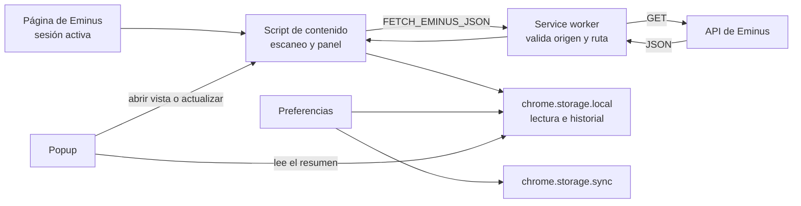
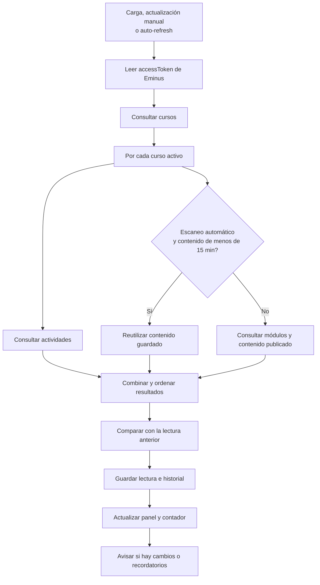
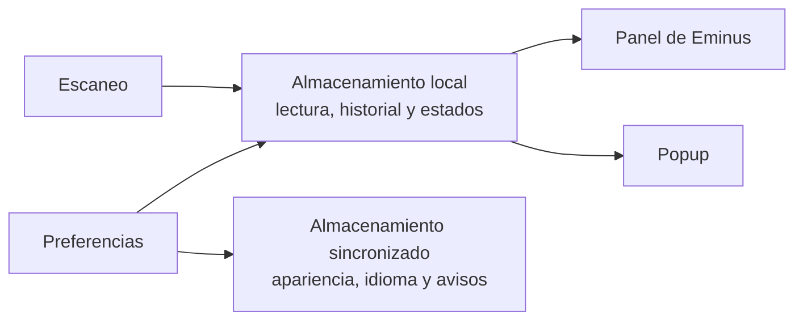

# Miyu --pendientes

Extensión Manifest V3 para Eminus (eminus.uv.mx). Muestra tus pendientes sin abrir cada curso.

Funciones:

- Tareas por materia con nivel de urgencia
- Historial de revisiones
- Animación al entregar tarea
- Resumen, filtros y notificaciones que abren la tarea
- Vista Hoy, orden configurable y exportación a .ics (semana completa o tarea suelta)
- Recordatorios escalonados con horas silenciosas y opción de posponer 1 h o hasta mañana
- Contadores en las pestañas (pendientes, hoy, vencidas y contenido sin leer)
- Perfil con apodo, nombre del panel, símbolo y mensaje al terminar
- Avisos por tipo: tareas, contenido, vencimientos y recordatorios
- Preferencias sincronizadas entre navegadores con respaldo local
- Popup con resumen, estado de sincronización y próximas entregas
- Portada con carga semanal y siguiente tarea
- Marcar contenido como leído o no leído

## Archivos

| Archivo | Descripción |
|---------|-------------|
| `manifest.json` | Configuración de la extensión |
| `content.js` | Arranque del panel: mensajes, atajos y eventos globales |
| `content/` | Módulos del panel (API, render, estado, temas, i18n, etc.) |
| `styles.css` | Estilos del panel |
| `content/themes.css` | Temas de color del panel |
| `service-worker.js` | Badge, notificaciones, alarmas y proxy de API |
| `popup.html` / `popup.js` / `popup.css` | Resumen al pulsar el icono |
| `detail-nav.js` / `detail-nav.css` | Botón volver en el detalle de actividad |
| `logo.png` | Icono |
| `jazmin.png` | Fondo decorativo del tema Jazmín |

## Cómo funciona

### Componentes y datos

El script de contenido lee la sesión de Eminus y solicita datos al service worker. Este valida el origen y el endpoint antes de consultar la API.

### Recorrido de un escaneo

Las actividades se consultan en cada escaneo. Los escaneos automáticos reutilizan el contenido publicado durante 15 minutos; `[ actualizar ]` y `R` vuelven a consultarlo.

### Dónde se guardan los datos

La lectura e historial quedan en el navegador. Las preferencias se guardan localmente y se sincronizan con Chrome.

## Instalación (modo desarrollador)

1. Abre `chrome://extensions/`
2. Activa Developer mode
3. Clic en Load unpacked
4. Selecciona esta carpeta

## Uso

1. Inicia sesión en Eminus
2. Abre cualquier página en `https://eminus.uv.mx/eminus4/`
3. Verás el panel a la derecha
4. Pulsa el icono para ver el resumen desde cualquier pestaña
5. Usa `[ actualizar ]` para refrescar
6. En `Historial` ves los cambios
7. `Alt+E` pliega y despliega el panel
8. `/` busca, `Esc` limpia la búsqueda, `R` actualiza, `T` abre Hoy y `1`-`7` cambian de pestaña

## Desarrollo

Requiere Node 22. Instala las herramientas con `npm install` y corre todo con `npm run check` (es lo mismo que ejecuta el CI de GitHub):

- `npm run lint`: ESLint sobre todo el JS.
- `npm run check-i18n`: verifica que los 6 idiomas tengan las mismas claves que `es` y que el código no use claves inexistentes. Córrelo tras tocar `content/i18n.js` o textos de la interfaz.
- `npm test`: pruebas de la lógica pura (fechas, urgencia, pendientes, temas, i18n) con el runner nativo de Node.

## Notas

- Usa el `accessToken` de tu sesión en Eminus.
- Consulta `GET /Course/getAllCourses` y `GET /Activity/getActividadesEstudiante/{idCurso}`
- Guarda en `chrome.storage.local` claves como `eminusLastSnapshot`, `eminusPendingLog`, `eminusPanelTheme`
- Sincroniza apariencia y avisos con `chrome.storage.sync`

El auto-refresh usa `chrome.alarms` y funciona con el panel plegado si hay una pestaña de Eminus abierta.

Los escaneos automáticos (al cargar la página, auto-refresh, al volver la conexión) reutilizan el contenido publicado del último escaneo si tiene menos de 15 minutos; las actividades se consultan siempre. `[ actualizar ]` y la tecla `R` fuerzan un escaneo completo.

## Datos y privacidad

Miyu lee el `accessToken` de Eminus desde el almacenamiento de la página para consultar cursos, actividades y contenido. No lo copia al almacenamiento de la extensión.

La extensión guarda en el navegador el último resultado del escaneo, el historial de cambios, el identificador de cuenta y estados como archivados, fijados y contenido leído. Sincroniza preferencias de apariencia, idioma, recordatorios y cursos con `chrome.storage.sync`; conserva también una copia local.

En la pestaña `Configuración`, abre `Datos y preferencias` para borrar los datos de lectura o borrar los datos y preferencias. La segunda opción también elimina las preferencias sincronizadas.
